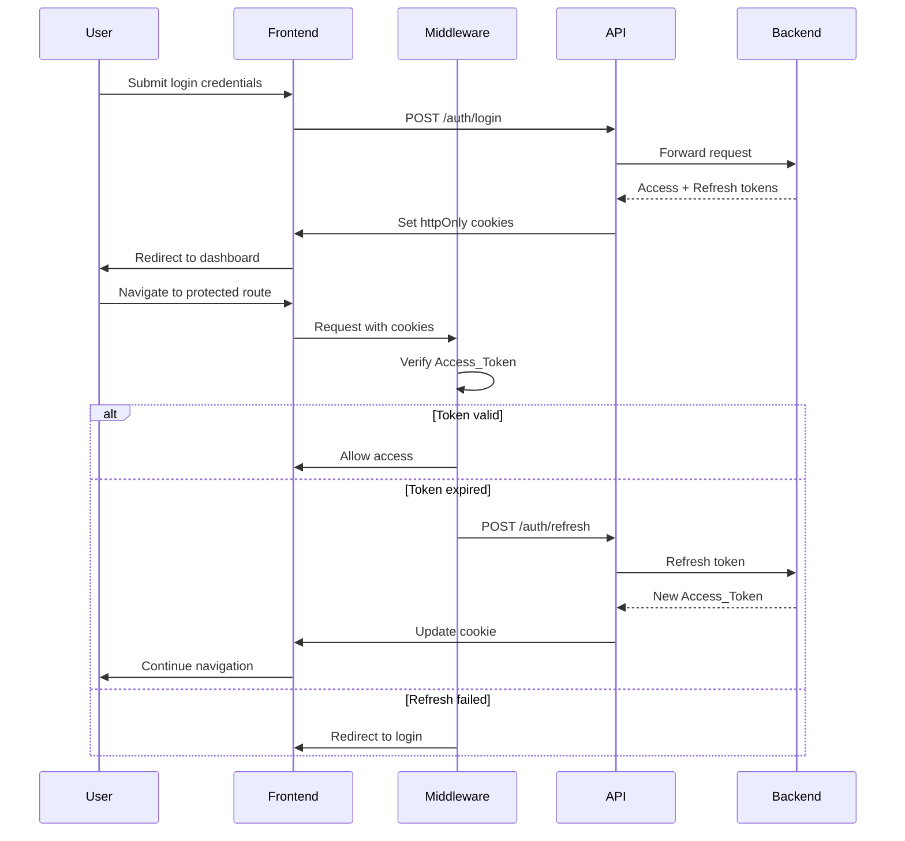

# Design Document: AthleteShield Frontend

## Overview

The AthleteShield frontend is a privacy-first, role-based web application built with Next.js 14+ (App Router), TypeScript, and React. The application interfaces with an existing NestJS backend API to provide secure authentication, athlete identity verification workflows, credential management, abuse reporting, and administrative functions. The architecture emphasizes security, accessibility, and user experience across five distinct user roles: Athletes, Coaches, Federations, Administrators, and Investigators.

### Technology Stack

- **Framework**: Next.js 14+ (App Router with React Server Components)
- **Language**: TypeScript 5+
- **UI Library**: React 18+
- **Styling**: Tailwind CSS with custom design system
- **State Management**: Zustand for client state, React Query for server state
- **Forms**: React Hook Form with Zod validation
- **API Client**: Axios with interceptors
- **Authentication**: JWT with httpOnly cookies
- **File Upload**: React Dropzone with progress tracking
- **QR Codes**: qrcode.react for generation, html5-qrcode for scanning
- **Charts**: Recharts for metrics visualization
- **Testing**: Vitest for unit tests, Playwright for E2E tests

## Architecture

### Application Structure

```
athleteshield-frontend/
├── src/
│   ├── app/                      # Next.js App Router pages
│   │   ├── (auth)/              # Auth layout group
│   │   │   ├── login/
│   │   │   └── register/
│   │   ├── (public)/            # Public layout group
│   │   │   ├── report/
│   │   │   ├── track/
│   │   │   └── verify-qr/
│   │   ├── (athlete)/           # Athlete portal
│   │   │   ├── dashboard/
│   │   │   ├── profile/
│   │   │   ├── documents/
│   │   │   ├── verifications/
│   │   │   └── credentials/
│   │   ├── (federation)/        # Federation portal
│   │   │   ├── dashboard/
│   │   │   ├── verification-requests/
│   │   │   └── members/
│   │   ├── (admin)/             # Admin/Investigator portal
│   │   │   ├── dashboard/
│   │   │   ├── reports/
│   │   │   ├── audit-logs/
│   │   │   └── metrics/
│   │   ├── layout.tsx           # Root layout
│   │   └── page.tsx             # Home page
│   ├── components/              # React components
│   │   ├── ui/                  # Base UI components
│   │   ├── forms/               # Form components
│   │   ├── layouts/             # Layout components
│   │   └── features/            # Feature-specific components
│   ├── lib/                     # Utilities and configurations
│   │   ├── api/                 # API client and endpoints
│   │   ├── auth/                # Authentication utilities
│   │   ├── hooks/               # Custom React hooks
│   │   ├── stores/              # Zustand stores
│   │   ├── utils/               # Helper functions
│   │   └── validations/         # Zod schemas
│   ├── types/                   # TypeScript type definitions
│   └── middleware.ts            # Next.js middleware for auth
├── public/                      # Static assets
└── tests/                       # Test files
```

### Route Protection Strategy

Next.js middleware intercepts all requests and enforces authentication and authorization:

1. **Public Routes**: `/`, `/login`, `/register`, `/report`, `/track`, `/verify-qr` - accessible without authentication
2. **Protected Routes**: All other routes require valid authentication
3. **Role-Based Routes**: Middleware checks user role and redirects unauthorized access
4. **Token Validation**: Middleware verifies Access_Token on every request
5. **Automatic Refresh**: Client-side interceptor handles token refresh transparently

### Authentication Flow



## Components and Interfaces

### Core Components

#### 1. Authentication Components

**LoginForm**
- Input fields: email, password
- Client-side validation with Zod
- Submit handler calls API client
- Error display for invalid credentials
- Loading state during submission
- "Remember me" option
- Link to registration page

**RegisterForm**
- Input fields: email, password, confirmPassword, name, role
- Role selection dropdown with descriptions
- Password strength indicator
- Client-side validation
- Submit handler calls API client
- Success redirect to login

**ProtectedRoute**
- Higher-order component for route protection
- Checks authentication status from auth store
- Verifies user role against allowed roles
- Redirects to login if unauthenticated
- Redirects to home if unauthorized
- Shows loading state during auth check

#### 2. Layout Components

**RootLayout**
- Provides global context providers
- Includes navigation based on auth state
- Renders role-specific navigation items
- Includes notification system
- Provides toast notification container

**Navigation**
- Responsive design (mobile hamburger, desktop sidebar)
- Role-based menu items
- Active route highlighting
- User profile dropdown
- Logout button
- Notification badge with count

**MobileNav**
- Hamburger menu icon
- Slide-out drawer
- Touch-optimized menu items
- Closes on route navigation

#### 3. Athlete Portal Components

**ProfileForm**
- Personal info section: name, DOB, nationality, contact
- Sport details section: sport, discipline, level, achievements
- Editable fields with save button
- Loading state while fetching/saving
- Success/error feedback
- Validation for required fields

**DocumentUpload**
- Drag-and-drop file upload zone
- File type validation (PDF, JPG, PNG)
- File size validation (max 10MB)
- Upload progress bar
- Document type selection dropdown
- Encryption indicator message

**DocumentList**
- Table/grid view of uploaded documents
- Columns: filename, type, upload date, status
- Click to preview/download
- Filter by document type
- Sort by date
- Delete button with confirmation

**VerificationRequestForm**
- Federation selection dropdown
- Document attachment checklist
- Verification claims textarea
- Submit button
- Success message with tracking ID

**VerificationRequestList**
- List of athlete's verification requests
- Status badges: PENDING, APPROVED, REJECTED
- Click to view details
- Filter by status
- Sort by date

**CredentialCard**
- Displays credential details
- Status badge: ACTIVE, EXPIRED, REVOKED
- Issuer information
- Issue and expiration dates
- "Generate QR Code" button (if active)
- Download as PDF button

**QRCodeDisplay**
- Generates QR code from credential token
- Display QR code image
- Share button
- Download QR code button
- Instructions for scanning

#### 4. Federation Portal Components

**VerificationRequestCard**
- Athlete name and profile summary
- Request date and status
- Attached documents list
- Verification claims
- Approve/Reject buttons
- Document preview modal

**DocumentPreview**
- Modal component for document viewing
- PDF viewer for PDF files
- Image viewer for JPG/PNG
- Download button
- Close button

**RejectionModal**
- Textarea for rejection reason
- Cancel and confirm buttons
- Validation for required reason

**MemberList**
- Table of federation members
- Columns: name, email, role, status, join date
- Add member button
- Remove member button with confirmation
- Filter by status

**AddMemberForm**
- Email input
- Role selection
- Invitation message textarea
- Send invitation button

#### 5. Admin/Investigator Portal Components

**ReportCard**
- Report summary information
- Status badge
- Severity indicator
- Assigned investigator
- Click to view details
- Assign/reassign button

**ReportDetails**
- Full incident description
- Evidence files list
- Investigation timeline
- Status update dropdown
- Assign investigator dropdown
- Save changes button

**AuditLogTable**
- Paginated table of audit logs
- Columns: timestamp, user, action, resource, IP, result
- Filter controls: date range, user, action type
- Export button (CSV/JSON)
- Click row to view details

**AuditLogDetails**
- Modal with full log entry
- Request/response data
- User agent information
- Close button

**MetricsDashboard**
- Summary cards: total users, active verifications, pending reports
- Time-series charts: registrations, verifications, reports
- Date range selector
- Auto-refresh toggle
- System health indicators

**MetricCard**
- Displays single metric value
- Trend indicator (up/down)
- Comparison to previous period
- Icon representing metric type

**TimeSeriesChart**
- Line chart for time-series data
- Responsive design
- Tooltip on hover
- Legend
- Axis labels

#### 6. Public Components

**AbuseReportForm**
- Incident description textarea
- Date picker
- Location input
- Involved parties input
- Evidence file upload (multiple)
- Anonymous submission checkbox
- Submit button
- Privacy notice

**ReportTrackingForm**
- Public tracking ID input
- Submit button
- Display report status
- Status timeline
- No authentication required

**QRScanner**
- Camera access for QR scanning
- Manual token entry option
- Scan result display
- Verification status display
- Error handling for invalid codes

**CredentialVerificationDisplay**
- Athlete name
- Issuing federation
- Issue date
- Verification status
- Trust indicators

#### 7. Shared UI Components

**Button**
- Variants: primary, secondary, danger, ghost
- Sizes: sm, md, lg
- Loading state with spinner
- Disabled state
- Icon support

**Input**
- Text, email, password, number types
- Label and error message
- Required indicator
- Disabled state
- Icon support

**Select**
- Dropdown with options
- Label and error message
- Required indicator
- Disabled state
- Search functionality for long lists

**Textarea**
- Multi-line text input
- Label and error message
- Character count
- Resize control

**FileUpload**
- Drag-and-drop zone
- File type and size validation
- Preview for images
- Progress bar
- Remove file button

**Modal**
- Overlay background
- Close button
- Header, body, footer sections
- Keyboard navigation (ESC to close)
- Focus trap

**Toast**
- Success, error, warning, info variants
- Auto-dismiss after timeout
- Manual dismiss button
- Queue multiple toasts
- Position: top-right

**LoadingSpinner**
- Sizes: sm, md, lg
- Color variants
- Centered or inline

**SkeletonLoader**
- Placeholder for loading content
- Variants for text, image, card
- Animated shimmer effect

**Badge**
- Status indicators
- Color variants
- Sizes: sm, md, lg

**Card**
- Container with shadow
- Header, body, footer sections
- Hover effects

**Table**
- Responsive table component
- Sortable columns
- Pagination
- Row selection
- Empty state

**Pagination**
- Page number buttons
- Previous/next buttons
- Page size selector
- Total count display

## Data Models

### Frontend Type Definitions

```typescript
// User and Authentication
interface User {
  id: string;
  email: string;
  name: string;
  role: UserRole;
  createdAt: string;
  updatedAt: string;
}

enum UserRole {
  ATHLETE = 'ATHLETE',
  COACH = 'COACH',
  FEDERATION = 'FEDERATION',
  ADMIN = 'ADMIN',
  INVESTIGATOR = 'INVESTIGATOR'
}

interface AuthTokens {
  accessToken: string;
  refreshToken: string;
}

interface AuthState {
  user: User | null;
  isAuthenticated: boolean;
  isLoading: boolean;
  login: (email: string, password: string) => Promise<void>;
  logout: () => Promise<void>;
  refreshToken: () => Promise<void>;
  checkAuth: () => Promise<void>;
}

// Athlete Profile
interface AthleteProfile {
  id: string;
  userId: string;
  dateOfBirth: string;
  nationality: string;
  phone: string;
  address: string;
  sport: string;
  discipline: string;
  competitionLevel: string;
  achievements: string;
  createdAt: string;
  updatedAt: string;
}

// Documents
interface Document {
  id: string;
  athleteId: string;
  filename: string;
  fileType: string;
  fileSize: number;
  documentType: DocumentType;
  uploadDate: string;
  encryptionStatus: string;
  verificationStatus: VerificationStatus;
  url: string;
}

enum DocumentType {
  ID_PROOF = 'ID_PROOF',
  MEDICAL_RECORD = 'MEDICAL_RECORD',
  CERTIFICATE = 'CERTIFICATE',
  OTHER = 'OTHER'
}

enum VerificationStatus {
  PENDING = 'PENDING',
  VERIFIED = 'VERIFIED',
  REJECTED = 'REJECTED'
}

// Verification Requests
interface VerificationRequest {
  id: string;
  athleteId: string;
  federationId: string;
  status: RequestStatus;
  claims: string;
  attachedDocuments: string[];
  submittedAt: string;
  reviewedAt?: string;
  reviewedBy?: string;
  rejectionReason?: string;
}

enum RequestStatus {
  PENDING = 'PENDING',
  APPROVED = 'APPROVED',
  REJECTED = 'REJECTED'
}

// Credentials
interface Credential {
  id: string;
  athleteId: string;
  federationId: string;
  issuer: string;
  issuedAt: string;
  expiresAt: string;
  status: CredentialStatus;
  claims: Record<string, any>;
  signature: string;
  qrToken?: string;
  revocationReason?: string;
  revokedAt?: string;
}

enum CredentialStatus {
  ACTIVE = 'ACTIVE',
  EXPIRED = 'EXPIRED',
  REVOKED = 'REVOKED'
}

// Abuse Reports
interface AbuseReport {
  id: string;
  publicId: string;
  reporterId?: string;
  subjectId?: string;
  incidentDescription: string;
  incidentDate: string;
  location: string;
  involvedParties: string;
  status: ReportStatus;
  severity: ReportSeverity;
  assignedTo?: string;
  submittedAt: string;
  updatedAt: string;
  evidence: Evidence[];
}

enum ReportStatus {
  SUBMITTED = 'SUBMITTED',
  UNDER_REVIEW = 'UNDER_REVIEW',
  INVESTIGATING = 'INVESTIGATING',
  RESOLVED = 'RESOLVED',
  CLOSED = 'CLOSED'
}

enum ReportSeverity {
  LOW = 'LOW',
  MEDIUM = 'MEDIUM',
  HIGH = 'HIGH',
  CRITICAL = 'CRITICAL'
}

interface Evidence {
  id: string;
  reportId: string;
  filename: string;
  fileType: string;
  uploadDate: string;
  url: string;
}

// Audit Logs
interface AuditLog {
  id: string;
  timestamp: string;
  userId: string;
  userName: string;
  action: string;
  resource: string;
  resourceId: string;
  ipAddress: string;
  userAgent: string;
  result: 'SUCCESS' | 'FAILURE';
  requestData?: Record<string, any>;
  responseData?: Record<string, any>;
}

// Metrics
interface SystemMetrics {
  totalUsers: number;
  usersByRole: Record<UserRole, number>;
  activeVerifications: number;
  issuedCredentials: number;
  pendingReports: number;
  systemHealth: {
    apiStatus: 'HEALTHY' | 'DEGRADED' | 'DOWN';
    databaseStatus: 'HEALTHY' | 'DEGRADED' | 'DOWN';
    queueStatus: 'HEALTHY' | 'DEGRADED' | 'DOWN';
  };
}

interface TimeSeriesData {
  date: string;
  registrations: number;
  verifications: number;
  reports: number;
}

// Federation Members
interface FederationMember {
  id: string;
  federationId: string;
  userId: string;
  name: string;
  email: string;
  role: string;
  status: MemberStatus;
  joinedAt: string;
}

enum MemberStatus {
  ACTIVE = 'ACTIVE',
  PENDING = 'PENDING',
  INACTIVE = 'INACTIVE'
}

// Notifications
interface Notification {
  id: string;
  userId: string;
  type: NotificationType;
  title: string;
  message: string;
  read: boolean;
  link?: string;
  createdAt: string;
}

enum NotificationType {
  VERIFICATION_STATUS = 'VERIFICATION_STATUS',
  NEW_REQUEST = 'NEW_REQUEST',
  REPORT_ASSIGNED = 'REPORT_ASSIGNED',
  CREDENTIAL_ISSUED = 'CREDENTIAL_ISSUED',
  SYSTEM_ALERT = 'SYSTEM_ALERT'
}

// API Response Types
interface ApiResponse<T> {
  data: T;
  message?: string;
  success: boolean;
}

interface PaginatedResponse<T> {
  data: T[];
  total: number;
  page: number;
  pageSize: number;
  totalPages: number;
}

interface ApiError {
  message: string;
  errors?: Record<string, string[]>;
  statusCode: number;
}
```

### State Management

**Auth Store (Zustand)**
```typescript
interface AuthStore {
  user: User | null;
  isAuthenticated: boolean;
  isLoading: boolean;
  setUser: (user: User | null) => void;
  setAuthenticated: (value: boolean) => void;
  setLoading: (value: boolean) => void;
  reset: () => void;
}
```

**Notification Store (Zustand)**
```typescript
interface NotificationStore {
  notifications: Notification[];
  unreadCount: number;
  addNotification: (notification: Notification) => void;
  markAsRead: (id: string) => void;
  markAllAsRead: () => void;
  removeNotification: (id: string) => void;
  fetchNotifications: () => Promise<void>;
}
```

**UI Store (Zustand)**
```typescript
interface UIStore {
  isMobileMenuOpen: boolean;
  activeModal: string | null;
  toggleMobileMenu: () => void;
  openModal: (modalId: string) => void;
  closeModal: () => void;
}
```

### API Client Configuration

```typescript
// API Client with Interceptors
class ApiClient {
  private axiosInstance: AxiosInstance;
  private isRefreshing: boolean = false;
  private refreshQueue: Array<(token: string) => void> = [];

  constructor() {
    this.axiosInstance = axios.create({
      baseURL: process.env.NEXT_PUBLIC_API_URL || 'http://localhost:3000/api/v1',
      timeout: 30000,
      withCredentials: true, // Send cookies
    });

    this.setupInterceptors();
  }

  private setupInterceptors() {
    // Request interceptor
    this.axiosInstance.interceptors.request.use(
      (config) => {
        // Access token is sent via httpOnly cookie automatically
        return config;
      },
      (error) => Promise.reject(error)
    );

    // Response interceptor
    this.axiosInstance.interceptors.response.use(
      (response) => response,
      async (error) => {
        const originalRequest = error.config;

        // Handle 401 Unauthorized
        if (error.response?.status === 401 && !originalRequest._retry) {
          if (this.isRefreshing) {
            // Queue request while refresh is in progress
            return new Promise((resolve) => {
              this.refreshQueue.push((token: string) => {
                resolve(this.axiosInstance(originalRequest));
              });
            });
          }

          originalRequest._retry = true;
          this.isRefreshing = true;

          try {
            // Attempt token refresh
            await this.axiosInstance.post('/auth/refresh');
            
            // Process queued requests
            this.refreshQueue.forEach((callback) => callback('refreshed'));
            this.refreshQueue = [];
            
            // Retry original request
            return this.axiosInstance(originalRequest);
          } catch (refreshError) {
            // Refresh failed, redirect to login
            this.refreshQueue = [];
            useAuthStore.getState().reset();
            window.location.href = '/login';
            return Promise.reject(refreshError);
          } finally {
            this.isRefreshing = false;
          }
        }

        return Promise.reject(error);
      }
    );
  }

  // HTTP methods
  async get<T>(url: string, config?: AxiosRequestConfig): Promise<T> {
    const response = await this.axiosInstance.get<ApiResponse<T>>(url, config);
    return response.data.data;
  }

  async post<T>(url: string, data?: any, config?: AxiosRequestConfig): Promise<T> {
    const response = await this.axiosInstance.post<ApiResponse<T>>(url, data, config);
    return response.data.data;
  }

  async put<T>(url: string, data?: any, config?: AxiosRequestConfig): Promise<T> {
    const response = await this.axiosInstance.put<ApiResponse<T>>(url, data, config);
    return response.data.data;
  }

  async delete<T>(url: string, config?: AxiosRequestConfig): Promise<T> {
    const response = await this.axiosInstance.delete<ApiResponse<T>>(url, config);
    return response.data.data;
  }

  async uploadFile<T>(url: string, file: File, onProgress?: (progress: number) => void): Promise<T> {
    const formData = new FormData();
    formData.append('file', file);

    const response = await this.axiosInstance.post<ApiResponse<T>>(url, formData, {
      headers: { 'Content-Type': 'multipart/form-data' },
      onUploadProgress: (progressEvent) => {
        if (onProgress && progressEvent.total) {
          const progress = Math.round((progressEvent.loaded * 100) / progressEvent.total);
          onProgress(progress);
        }
      },
    });

    return response.data.data;
  }
}

export const apiClient = new ApiClient();
```

## Correctness Properties

*A property is a characteristic or behavior that should hold true across all valid executions of a system—essentially, a formal statement about what the system should do. Properties serve as the bridge between human-readable specifications and machine-verifiable correctness guarantees.*


### Property 1: Token Refresh on Expiration
*For any* API request that receives a 401 Unauthorized response, the system should automatically attempt to refresh the access token using the refresh token, retry the original request with the new token if refresh succeeds, or redirect to login and clear auth state if refresh fails.
**Validates: Requirements 1.2, 1.3, 17.1, 17.2, 17.3**

### Property 2: Concurrent Token Refresh Deduplication
*For any* set of concurrent API requests that all receive 401 responses, the system should queue all requests and perform only a single token refresh operation, then process all queued requests with the new token.
**Validates: Requirements 17.4**

### Property 3: Unauthenticated Route Protection
*For any* protected route, when accessed by an unauthenticated user, the system should redirect to the login page.
**Validates: Requirements 3.1**

### Property 4: Role-Based Route Authorization
*For any* authenticated user attempting to access a route not permitted for their role, the system should display an access denied message and redirect to their role-appropriate home page.
**Validates: Requirements 3.2, 3.6**

### Property 5: Authentication State UI Synchronization
*For any* change to authentication state (login, logout, token refresh, session expiration), the system should update all UI elements to reflect the current authentication status.
**Validates: Requirements 1.6**

### Property 6: Form Validation Error Display
*For any* form submission with invalid data, the system should display validation errors inline with the relevant form fields, and clear errors when fields are corrected.
**Validates: Requirements 2.4, 15.1, 15.2**

### Property 7: Input Validation Rules
*For any* form input, the system should validate according to field type rules (email format, password strength minimum 8 characters, required fields, file types PDF/JPG/PNG, file size maximum 10MB) and reject invalid inputs before submission.
**Validates: Requirements 2.5, 5.6, 15.3**

### Property 8: API Validation Error Mapping
*For any* validation error returned by the Backend_API, the system should map the error to the corresponding form field and display it inline.
**Validates: Requirements 15.4**

### Property 9: Role-Based Navigation Display
*For any* authenticated user, the system should display navigation items appropriate to their role (ATHLETE: Dashboard, Profile, Documents, Verifications, Credentials; FEDERATION: Dashboard, Verification Requests, Members; ADMIN/INVESTIGATOR: Dashboard, Reports, Audit Logs, Metrics).
**Validates: Requirements 14.3, 14.5, 14.6, 14.7**

### Property 10: Active Navigation Highlighting
*For any* route navigation, the system should highlight the current active navigation item.
**Validates: Requirements 14.8**

### Property 11: Profile Update Feedback
*For any* profile update submission, the system should send the data to Backend_API and display either success or error feedback based on the response.
**Validates: Requirements 4.2**

### Property 12: Profile Update Error Preservation
*For any* failed profile update, the system should display error messages and preserve all user input in the form fields.
**Validates: Requirements 4.6, 10.6**

### Property 13: File Upload with Encryption Headers
*For any* file upload, the system should send the file to Backend_API with appropriate encryption headers.
**Validates: Requirements 5.2**

### Property 14: File Upload Progress Display
*For any* file upload in progress, the system should display the upload progress as a percentage.
**Validates: Requirements 5.3, 16.6**

### Property 15: File Upload Success Handling
*For any* successful file upload, the system should refresh the document list and display a success message.
**Validates: Requirements 5.4**

### Property 16: File Upload Failure Handling
*For any* failed file upload, the system should display an error message with the failure reason.
**Validates: Requirements 5.5**

### Property 17: Document Metadata Display
*For any* uploaded document, the system should display metadata including filename, upload date, document type, and verification status.
**Validates: Requirements 5.7**

### Property 18: Document Click Action
*For any* document clicked by an athlete, the system should fetch and display the document preview or download link.
**Validates: Requirements 5.8**

### Property 19: Verification Request Submission
*For any* verification request submitted with required documents, the system should send the request to Backend_API.
**Validates: Requirements 6.2**

### Property 20: Verification Request Success Confirmation
*For any* successfully submitted verification request, the system should display a confirmation message and request tracking ID.
**Validates: Requirements 6.3**

### Property 21: Verification Request Status Display
*For any* verification request viewed by an athlete, the system should display the current status (PENDING, APPROVED, REJECTED).
**Validates: Requirements 6.4**

### Property 22: Verification Status Change UI Update
*For any* verification request status change, the system should update the UI to reflect the new status.
**Validates: Requirements 6.6**

### Property 23: Verification Request Details Display
*For any* verification request clicked by a federation user, the system should display athlete profile, uploaded documents, and verification claims.
**Validates: Requirements 7.2**

### Property 24: Verification Approval Action
*For any* verification approval by a federation user, the system should send the approval request to Backend_API and update the request status.
**Validates: Requirements 7.3**

### Property 25: Verification Rejection Action
*For any* verification rejection by a federation user, the system should prompt for a rejection reason and send the rejection request to Backend_API.
**Validates: Requirements 7.4**

### Property 26: Document Preview Display
*For any* verification request under federation review, the system should display document previews inline.
**Validates: Requirements 7.5**

### Property 27: Verification Action Completion
*For any* completed verification action (approve/reject), the system should display a success message and remove the request from the pending list.
**Validates: Requirements 7.6**

### Property 28: Credential Details Display
*For any* credential clicked by an athlete, the system should display full details including issuer, issue date, expiration date, and claims.
**Validates: Requirements 8.2**

### Property 29: Credential Status Display
*For any* credential, the system should display its status (ACTIVE, EXPIRED, REVOKED).
**Validates: Requirements 8.3**

### Property 30: Active Credential QR Button
*For any* credential with ACTIVE status, the system should display a "Generate QR Code" button.
**Validates: Requirements 8.4**

### Property 31: QR Code Generation
*For any* QR code generation request for an active credential, the system should generate and display a scannable QR code.
**Validates: Requirements 8.5**

### Property 32: Credential Download and Share
*For any* credential, the system should allow the athlete to download it as PDF or share via QR code.
**Validates: Requirements 8.6**

### Property 33: Valid QR Verification
*For any* valid QR_Token scanned or entered, the system should send a verification request to Backend_API and display credential details (athlete name, issuing federation, issue date, verification status).
**Validates: Requirements 9.2, 9.3**

### Property 34: Invalid QR Verification
*For any* invalid or expired QR_Token, the system should display an error message indicating the credential is invalid or expired.
**Validates: Requirements 9.4**

### Property 35: Anonymous Report Submission
*For any* abuse report submitted with required details, the system should send the report to Backend_API without requiring authentication.
**Validates: Requirements 10.2**

### Property 36: Report Submission Success
*For any* successfully submitted abuse report, the system should display a public tracking ID.
**Validates: Requirements 10.3**

### Property 37: Report Tracking Lookup
*For any* public tracking ID entered, the system should fetch and display the report status from Backend_API.
**Validates: Requirements 11.1**

### Property 38: Report Status Display
*For any* tracked report, the system should display the current status (SUBMITTED, UNDER_REVIEW, INVESTIGATING, RESOLVED, CLOSED).
**Validates: Requirements 11.2**

### Property 39: Report Status Timestamps
*For any* tracked report, the system should display timestamps for status updates.
**Validates: Requirements 11.3**

### Property 40: Report Privacy Protection
*For any* publicly tracked report or athlete-viewed report, the system should not display reporter identity or sensitive investigation details.
**Validates: Requirements 11.4, 23.3**

### Property 41: Invalid Tracking ID Error
*For any* invalid tracking ID entered, the system should display an error message.
**Validates: Requirements 11.5**

### Property 42: Admin Report Details Display
*For any* report clicked by an admin, the system should display full report details including evidence and investigation history.
**Validates: Requirements 12.2**

### Property 43: Report Assignment Action
*For any* report assigned to an investigator by an admin, the system should send the assignment request to Backend_API and update the report status.
**Validates: Requirements 12.3**

### Property 44: Report Status Update Action
*For any* report status update by an admin, the system should send the update to Backend_API and refresh the display.
**Validates: Requirements 12.4**

### Property 45: Audit Log Entry Display
*For any* audit log entry, the system should display timestamp, user, action, resource, IP address, and result.
**Validates: Requirements 13.2**

### Property 46: Audit Log Pagination
*For any* large audit log dataset, the system should support pagination.
**Validates: Requirements 13.4**

### Property 47: Audit Log Entry Details
*For any* audit log entry clicked by an admin, the system should display full log details including request/response data.
**Validates: Requirements 13.5**

### Property 48: Loading Indicator Display
*For any* data fetch from Backend_API, form submission, or content loading operation, the system should display an appropriate loading indicator (spinner, skeleton loader, or button loading state).
**Validates: Requirements 4.5, 16.1, 16.2, 16.5**

### Property 49: Success Message Display
*For any* successfully completed operation, the system should display a success message for 3 seconds.
**Validates: Requirements 16.3**

### Property 50: Error Message Display
*For any* failed operation, the system should display an error message until dismissed by the user.
**Validates: Requirements 16.4**

### Property 51: Form Submit Button Disable
*For any* form submission in progress, the system should disable the submit button.
**Validates: Requirements 15.5**

### Property 52: Network Error Handling
*For any* form submission that fails due to network error, the system should display a user-friendly error message with a retry option.
**Validates: Requirements 15.6, 17.6**

### Property 53: Authenticated Request Authorization Header
*For any* authenticated API request, the system should include the Access_Token in the Authorization header.
**Validates: Requirements 17.5**

### Property 54: Document Upload Encryption Message
*For any* document upload by an athlete, the system should display a message indicating the file will be encrypted.
**Validates: Requirements 18.1**

### Property 55: Trust Indicators Display
*For any* appropriate context (verified credentials, secure uploads, federation approvals), the system should display trust indicators such as verified badges, security icons, or encryption status.
**Validates: Requirements 18.3, 18.6**

### Property 56: Keyboard Navigation Support
*For any* interactive element, the system should provide keyboard navigation support.
**Validates: Requirements 19.1**

### Property 57: ARIA Attributes
*For any* UI element, the system should include appropriate ARIA labels and roles for screen reader compatibility.
**Validates: Requirements 19.2**

### Property 58: Color Contrast Compliance
*For any* text element, the system should maintain a color contrast ratio of at least 4.5:1.
**Validates: Requirements 19.3**

### Property 59: Text Alternatives
*For any* non-text content (images, icons, charts), the system should provide text alternatives.
**Validates: Requirements 19.4**

### Property 60: Focus Indicators
*For any* interactive element, the system should provide visible focus indicators.
**Validates: Requirements 19.6**

### Property 61: Form Error Announcements
*For any* form with validation errors, the system should announce the errors to screen readers.
**Validates: Requirements 19.7**

### Property 62: Verification Status Change Notification
*For any* verification request status change, the system should display a notification to the athlete.
**Validates: Requirements 20.1**

### Property 63: New Verification Request Notification
*For any* new verification request received, the system should display a notification to federation users.
**Validates: Requirements 20.2**

### Property 64: Report Assignment Notification
*For any* report assigned to an investigator, the system should display a notification to that investigator.
**Validates: Requirements 20.3**

### Property 65: Notification Count Badge
*For any* unread notifications, the system should display a count badge on navigation items.
**Validates: Requirements 20.4**

### Property 66: Notification Click Action
*For any* notification clicked by a user, the system should navigate to the relevant page and mark the notification as read.
**Validates: Requirements 20.5**

### Property 67: Notification Persistence
*For any* unread notifications, the system should persist them across user sessions (logout and login).
**Validates: Requirements 20.6**

### Property 68: Federation Member Addition
*For any* new member added by a federation admin, the system should send an invitation request to Backend_API.
**Validates: Requirements 21.2**

### Property 69: Federation Member Removal
*For any* member removed by a federation admin, the system should send a removal request to Backend_API and update the member list.
**Validates: Requirements 21.3**

### Property 70: Federation Member Details Display
*For any* federation member, the system should display name, email, role, join date, and status.
**Validates: Requirements 21.4**

### Property 71: Federation Member Filtering
*For any* member status filter applied (ACTIVE, PENDING, INACTIVE), the system should display only members matching that status.
**Validates: Requirements 21.5**

### Property 72: Member Management Action Feedback
*For any* completed member management action (add/remove), the system should display success or error feedback.
**Validates: Requirements 21.6**

### Property 73: Metrics Date Range Filtering
*For any* date range filter applied to metrics, the system should display metrics for only that date range.
**Validates: Requirements 22.4**

### Property 74: Athlete Report Details Display
*For any* report where an athlete is the subject, the system should display incident date, status, and investigation stage.
**Validates: Requirements 23.2**

### Property 75: Athlete Report Click Action
*For any* report clicked by an athlete who is the subject, the system should display full report details available to subjects.
**Validates: Requirements 23.4**

### Property 76: Closed Investigation Resolution Display
*For any* closed investigation, the system should display the report resolution outcome.
**Validates: Requirements 23.6**

### Property 77: Revoked Credential Visual Distinction
*For any* revoked credential viewed by an athlete, the system should clearly indicate it with visual distinction from active credentials.
**Validates: Requirements 24.1**

### Property 78: Revoked Credential Details Display
*For any* revoked credential, the system should display the revocation reason and date.
**Validates: Requirements 24.2**

### Property 79: Revoked Credential Separation
*For any* credential list display, the system should display revoked credentials separately from active credentials.
**Validates: Requirements 24.3**

### Property 80: Revoked Credential Click Action
*For any* revoked credential clicked by an athlete, the system should display full revocation details.
**Validates: Requirements 24.4**

### Property 81: Revoked Credential QR Restriction
*For any* revoked credential, the system should not allow QR code generation.
**Validates: Requirements 24.5**

### Property 82: Revoked Credential Appeal Information
*For any* revoked credential, the system should display appeal process information.
**Validates: Requirements 24.6**

## Error Handling

### Client-Side Error Handling

**Form Validation Errors**
- Display inline with form fields
- Clear on field correction
- Prevent submission until resolved
- Provide helpful error messages

**API Errors**
- 400 Bad Request: Display validation errors mapped to form fields
- 401 Unauthorized: Trigger token refresh, redirect to login if refresh fails
- 403 Forbidden: Display access denied message, redirect to appropriate page
- 404 Not Found: Display "Resource not found" message
- 500 Internal Server Error: Display generic error message with retry option
- Network errors: Display "Connection failed" message with retry option

**File Upload Errors**
- File too large: Display size limit message
- Invalid file type: Display accepted types message
- Upload failed: Display error with retry option
- Network interrupted: Allow resume or retry

**Authentication Errors**
- Invalid credentials: Display "Invalid email or password"
- Session expired: Redirect to login with "Session expired" message
- Token refresh failed: Clear auth state, redirect to login

### Error Boundaries

Implement React Error Boundaries to catch and handle component errors:
- Display fallback UI for crashed components
- Log errors to monitoring service
- Provide "Reload" button to recover
- Prevent entire app crash from component errors

### Global Error Handler

Centralized error handling for uncaught errors:
- Log to console in development
- Send to error monitoring service in production
- Display user-friendly error toast
- Preserve user data when possible

## Testing Strategy

### Unit Testing

**Component Testing**
- Test individual UI components in isolation
- Verify props handling and rendering
- Test user interactions (clicks, inputs, form submissions)
- Test conditional rendering based on props/state
- Test accessibility attributes (ARIA labels, roles)

**Hook Testing**
- Test custom React hooks
- Verify state updates
- Test side effects
- Test cleanup functions

**Utility Function Testing**
- Test validation functions
- Test formatting functions
- Test data transformation functions
- Test edge cases and error conditions

**Store Testing**
- Test Zustand store actions
- Verify state updates
- Test store selectors
- Test store persistence

### Property-Based Testing

**Configuration**
- Use fast-check library for TypeScript
- Minimum 100 iterations per property test
- Tag each test with feature name and property number
- Reference design document property in test comments

**Property Test Examples**

```typescript
// Feature: athleteshield-frontend, Property 7: Input Validation Rules
test('validates email format for all inputs', () => {
  fc.assert(
    fc.property(fc.string(), (input) => {
      const isValid = validateEmail(input);
      const hasAtSymbol = input.includes('@');
      const hasDomain = input.split('@')[1]?.includes('.');
      
      if (isValid) {
        expect(hasAtSymbol && hasDomain).toBe(true);
      }
    }),
    { numRuns: 100 }
  );
});

// Feature: athleteshield-frontend, Property 3: Unauthenticated Route Protection
test('redirects unauthenticated users from all protected routes', () => {
  fc.assert(
    fc.property(
      fc.constantFrom('/dashboard', '/profile', '/documents', '/verifications', '/credentials'),
      (route) => {
        // Mock unauthenticated state
        useAuthStore.setState({ isAuthenticated: false, user: null });
        
        // Attempt to navigate to protected route
        const { result } = renderHook(() => useRouter());
        act(() => {
          result.current.push(route);
        });
        
        // Verify redirect to login
        expect(result.current.pathname).toBe('/login');
      }
    ),
    { numRuns: 100 }
  );
});

// Feature: athleteshield-frontend, Property 67: Notification Persistence
test('persists unread notifications across sessions', () => {
  fc.assert(
    fc.property(
      fc.array(fc.record({
        id: fc.uuid(),
        title: fc.string(),
        message: fc.string(),
        read: fc.constant(false),
      })),
      (notifications) => {
        // Add notifications
        notifications.forEach(n => useNotificationStore.getState().addNotification(n));
        
        // Simulate logout
        useAuthStore.getState().reset();
        
        // Simulate login
        useAuthStore.setState({ isAuthenticated: true, user: mockUser });
        
        // Fetch notifications
        useNotificationStore.getState().fetchNotifications();
        
        // Verify notifications persisted
        const persistedNotifications = useNotificationStore.getState().notifications;
        expect(persistedNotifications.length).toBe(notifications.length);
      }
    ),
    { numRuns: 100 }
  );
});
```

### Integration Testing

**API Integration Tests**
- Test API client with mock server
- Verify request/response handling
- Test token refresh flow
- Test error handling
- Test file upload with progress

**Route Integration Tests**
- Test navigation between pages
- Test route protection middleware
- Test role-based access control
- Test query parameter handling

**Form Integration Tests**
- Test complete form submission flows
- Test validation with API errors
- Test success/error feedback
- Test form reset after submission

### End-to-End Testing

**User Flow Tests (Playwright)**
- Test complete user journeys
- Test authentication flow (register, login, logout)
- Test athlete verification workflow
- Test federation approval workflow
- Test abuse report submission and tracking
- Test QR code generation and verification

**Cross-Browser Testing**
- Test on Chrome, Firefox, Safari, Edge
- Verify responsive design on different screen sizes
- Test accessibility with screen readers

**Performance Testing**
- Measure page load times
- Test with large datasets (many documents, credentials, reports)
- Verify infinite scroll/pagination performance
- Test file upload with large files

### Accessibility Testing

**Automated Testing**
- Use axe-core for automated accessibility checks
- Test color contrast ratios
- Verify ARIA attributes
- Test keyboard navigation

**Manual Testing**
- Test with screen readers (NVDA, JAWS, VoiceOver)
- Test keyboard-only navigation
- Test with browser zoom at 200%
- Verify focus management

### Test Coverage Goals

- Unit test coverage: 80% minimum
- Property test coverage: All correctness properties from design
- Integration test coverage: All critical user flows
- E2E test coverage: All primary user journeys
- Accessibility test coverage: All interactive components

### Continuous Integration

- Run unit and property tests on every commit
- Run integration tests on pull requests
- Run E2E tests on staging deployments
- Generate coverage reports
- Block merges if tests fail or coverage drops
