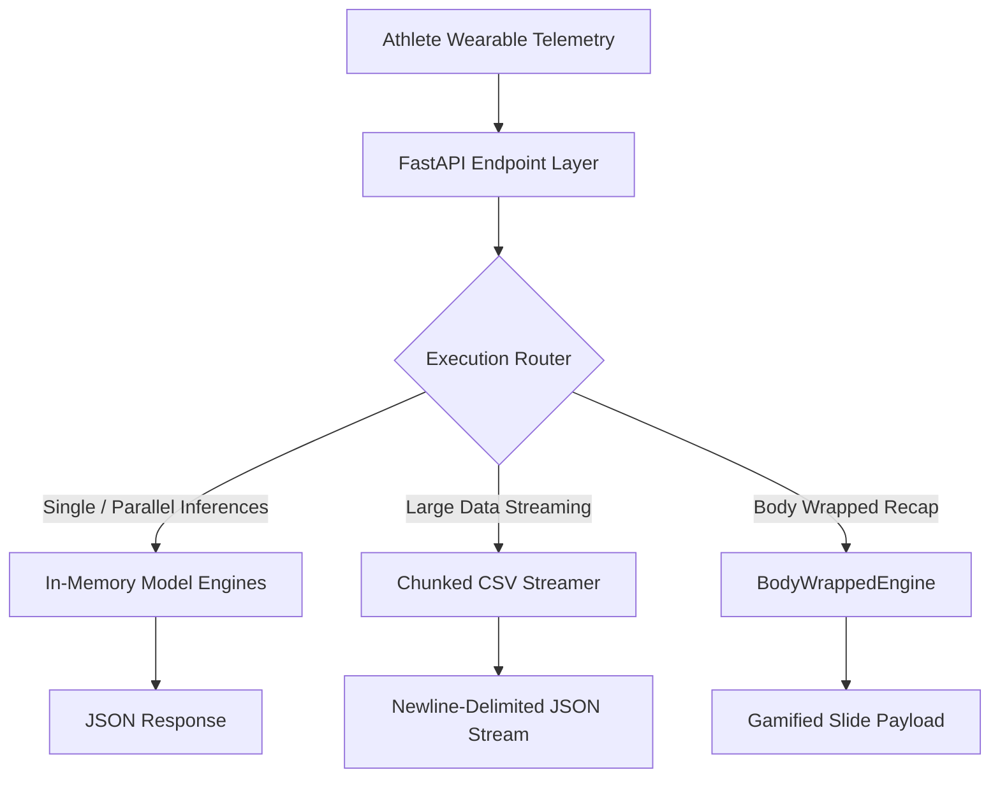

# ScreenSense | Athlete Performance Analytics Engine

An asynchronous, high-performance FastAPI analytics service designed for elite athlete performance monitoring. The engine integrates three specialized physiological models and a gamified weekly recap parser to process wearable telemetry data, run inferences, and return frontend-ready visualizations.

---

## 🚀 System Architecture



### Core Analytical Engines:
1. **Orthopedic Injury Risk Engine (`AcuteInjuryRiskEngine`)**: Evaluates Acute-to-Chronic Workload Ratio (ACWR), running power, cadence anomalies, and structural laxity indicators.
2. **CNS Fatigue & Illness Onset Engine (`CNSFatigueEngine`)**: Monitors autonomic homeostasis and physiological drift (HRV, RHR, Sleep Efficiency, Skin Temp) against rolling 21-day baselines.
3. **Metabolic Regulator Engine (`MetabolicRegulatorEngine`)**: Calculates thermodynamic energy balance, predicts 14-day weight class trajectories, and projects active glycogen depletion windows.
4. **Gamified Weekly Wrapped Engine (`BodyWrappedEngine`)**: Translates 7 days of multi-model telemetry into interactive story cards (inspired by Spotify Wrapped), resolving CNS/recovery archetypes with associated visual design themes.

---

## ⚡ API Reference

All requests and responses use standard JSON or Newline-Delimited JSON (NDJSON) streaming.

### 1. Health Status check
* **Route**: `GET /health`
* **Purpose**: Orchestration liveness probe. Checks if the startup data bootstrap successfully downloaded the remote telemetry cache.
* **Response**:
```json
{
  "status": "ok",
  "engines": ["injury_risk", "cns_fatigue", "metabolic"],
  "data_file_present": true,
  "data_path": "data/wearable_data.csv",
  "chunk_size": 10000
}
```

---

### 2. Acute Injury Risk Assessment
* **Route**: `POST /predict/injury-risk`
* **Purpose**: Evaluates orthopedic vulnerability.
* **Request Payload**:
```json
{
  "athlete_id": "athlete_42",
  "logs": [
    {
      "date": "2024-03-15",
      "workout_duration_minutes": 60.0,
      "workout_intensity": "high",
      "running_power": 280.0,
      "cadence": 172.0,
      "symptoms_logging": "sore"
    }
  ]
}
```
* **Response**:
```json
{
  "model_name": "orthopedic_injury_risk_engine",
  "prediction_target": "binary_injury_risk_state",
  "value": 0,
  "label": "NORMAL_STABLE",
  "confidence_bounds": 0.90,
  "feature_importance_vectors": {
    "acwr": 0.65,
    "cadence": 0.20,
    "structural_laxity_flag": 0.15
  },
  "engineered_metrics": {
    "calculated_acwr": 0.93,
    "structural_laxity_active": 0
  },
  "athlete_id": "athlete_42"
}
```

---

### 3. CNS Fatigue & Illness Onset Assessment
* **Route**: `POST /predict/cns-fatigue`
* **Purpose**: Analyzes homeostatic recovery and systemic burnout risk.
* **Request Payload**: (Same standard `logs` array)
* **Response**:
```json
{
  "model_name": "cns_fatigue_illness_engine",
  "prediction_target": "continuous_anomaly_score",
  "value": 30.0,
  "label": "PHYSIOLOGICAL_HOMEOSTASIS",
  "confidence_bounds": 0.96,
  "feature_importance_vectors": {
    "hrv_rmssd_deviation": -0.40,
    "skin_temp_deviation": 0.00,
    "resting_hr_deviation": 0.25
  },
  "athlete_id": "athlete_42"
}
```

---

### 4. Metabolic & Weight Regulation Assessment
* **Route**: `POST /predict/metabolic`
* **Purpose**: Evaluates calorie balance, weight trajectory, and glycogen depletion thresholds.
* **Request Payload**: Includes optional minimum weight category floor in kg.
```json
{
  "athlete_id": "athlete_42",
  "weight_category_floor_kg": 70.0,
  "logs": [
    {
      "date": "2024-03-15",
      "weight_kg": 72.4,
      "active_calories": 620.0,
      "calories_consumed": 2800.0,
      "basal_metabolic_rate": 1750.0,
      "blood_glucose_mg_dl": 92.0
    }
  ]
}
```
* **Response**:
```json
{
  "model_name": "metabolic_weight_regulator",
  "prediction_targets": {
    "predicted_weight_trajectory_14d": 72.02,
    "glycogen_depletion_window_minutes": 79.6
  },
  "category_floor_breached": 0,
  "confidence_bounds": 0.89,
  "intervention_directives": {
    "gym_programming": "MAINTAIN_CURRENT_METABOLIC_LOAD",
    "nutrition_adjustment_kcal": 0
  },
  "athlete_id": "athlete_42"
}
```

---

### 5. Composite Parallel Assessment
* **Route**: `POST /predict/all`
* **Purpose**: Executes all three prediction engines concurrently in a thread pool and returns a merged payload. Useful for landing dashboards.
* **Response**:
```json
{
  "athlete_id": "athlete_42",
  "injury_risk": { ... },
  "cns_fatigue": { ... },
  "metabolic": { ... }
}
```

---

### 6. Memory-Efficient Chunked CSV Streaming
* **Route**: `POST /predict/stream-csv`
* **Purpose**: Evaluates large telemetry datasets (e.g. 100k+ rows) page-by-page. Maintains rolling calculation continuity using a 28-row carry overlap buffer, maintaining a **< 5 MB peak RAM footprint**.
* **Query Parameters**:
  - `file_path`: Path to server disk CSV file (Defaults to bootstrapped data)
  - `chunk_size`: Batch window (Defaults to `10000` rows)
  - `weight_floor_kg`: Weight ceiling limit (Defaults to `70.0`)
* **Response Stream**: Newline-delimited JSON (NDJSON) chunks:
```json
{"chunk_index": 1, "chunk_row_start": 0, "chunk_row_end": 9999, "rows_processed": 10000, "injury_risk": {...}, "cns_fatigue": {...}, "metabolic": {...}}
{"chunk_index": 2, "chunk_row_start": 10000, "chunk_row_end": 19999, "rows_processed": 10000, "injury_risk": {...}, "cns_fatigue": {...}, "metabolic": {...}}
```

---

### 7. Weekly Body Wrapped
* **Route**: `POST /api/v1/analytics/wrapped`
* **Purpose**: Translates raw history into a gamified, slides-based visual recap package.
* **Request Payload**: (Accepts history logs)
```json
{
  "athlete_id": "athlete_42",
  "history": [
    {
      "date": "2026-05-15",
      "workout_duration_minutes": 60.0,
      "active_calories": 500.0,
      "hrv_rmssd": 60.0,
      "sleep_efficiency": 0.94,
      "resting_heart_rate": 50.0,
      "blood_glucose_mg_dl": 110.0
    },
    ... (Requires minimum 7 logs)
  ]
}
```
* **Response**:
```json
{
  "status": "success",
  "wrapped": {
    "time_horizon": "Past 7 Days",
    "slides": [
      {
        "slide_id": "total_minutes",
        "header": "YOUR BODY WAS TUNED IN",
        "primary_metric": "255 mins",
        "subtext": "Spent in active training states. Moving 5,015 active kilocalories total.",
        "percentage_trend_label": "-14% vs last week"
      },
      {
        "slide_id": "top_genre",
        "header": "YOUR GO-TO STIMULUS",
        "primary_metric": "HIGH",
        "subtext": "This training intensity single-handedly dominated your neuromuscular profile this week.",
        "percentage_trend_label": "Top Training Genre",
        "intensity_breakdown": {
          "high": 3,
          "medium": 2,
          "low": 2
        }
      },
      {
        "slide_id": "cns_vibe",
        "header": "YOUR PHYSIOLOGICAL VIBE TYPE",
        "primary_metric": "The Steady Cruiser",
        "subtext": "Balanced recovery metrics paired with consistent daily energy outputs. True homeostatic flow state.",
        "theme_colors": ["#10B981", "#059669"],
        "recovery_metrics": {
          "avg_hrv_rmssd_ms": 50.3,
          "avg_sleep_efficiency_pct": 92.1,
          "avg_resting_hr_bpm": 50.7,
          "hrv_trend_vs_last_week": "-23%"
        }
      },
      {
        "slide_id": "body_quirk",
        "header": "THE GLYCOGEN HIGH-POINT",
        "primary_metric": "135 mg/dL",
        "subtext": "Your peak systemic fuel saturation window lit up the charts on Sunday!",
        "percentage_trend_label": "Metabolic Peak"
      }
    ],
    "shareable_summary_card": {
      "title": "ScreenSense Body Wrapped",
      "total_minutes_active": 255,
      "total_calories_burned": 5015,
      "archetype": "The Steady Cruiser",
      "archetype_tier": "homeostasis",
      "avg_sleep_efficiency": "92%",
      "avg_hrv_ms": 50.3,
      "theme_colors": ["#10B981", "#059669"]
    }
  }
}
```

---

## 🎨 Frontend Design Guidelines

If you are building the user interface, here are the critical technical details and features built specifically for your design system:

### 1. The Handoff Vibe check & Theme Colors
The `cns_vibe` slide and `shareable_summary_card` return a `theme_colors` list containing two hex codes. Use these to paint dynamic, vibrant background linear gradients matching the athlete's physiological state:

*   **Supercompensation state** (`theme_colors`: `["#00F2FE", "#4FACFE"]`)
    *   *Visual Archetype*: **The Unstoppable Engine**
    *   *Design Vibe*: High-vibrancy neon cyan/blue gradient. Ideal for celebrating peak physical fitness.
*   **Functional Overreaching warning** (`theme_colors`: `["#F43F5E", "#BE123C"]`)
    *   *Visual Archetype*: **The Red-Line Warrior**
    *   *Design Vibe*: Aggressive coral-red gradient. Signals a warning to trigger rest or deload screens.
*   **Homeostasis state** (`theme_colors`: `["#10B981", "#059669"]`)
    *   *Visual Archetype*: **The Steady Cruiser**
    *   *Design Vibe*: Sleek emerald green gradient. Represents balanced recovery and clean baseline performance.

### 2. Client-Side NDJSON Streaming Consumption
When reading CSV analysis streams, the data is pushed line-by-line. Instead of waiting for the file to completely process, stream the results progressively to draw live status bars or load segments:

```javascript
async function fetchTelemetryStream() {
  const response = await fetch('/predict/stream-csv', { method: 'POST' });
  const reader = response.body.getReader();
  const decoder = new TextDecoder();
  
  let buffer = '';
  while (true) {
    const { done, value } = await reader.read();
    if (done) break;
    
    buffer += decoder.decode(value, { stream: true });
    const lines = buffer.split('\n');
    
    // Save trailing incomplete line back to buffer
    buffer = lines.pop(); 
    
    for (const line of lines) {
      if (line.trim()) {
        const payload = JSON.parse(line);
        console.log(`Processed chunk ${payload.chunk_index}:`, payload);
        // Trigger UI updates here!
      }
    }
  }
}
```

### 3. Missing Fields & Imputation Safety
You do not need to populate all telemetry parameters before hitting prediction engines. 
- The API is highly forgiving: sparse JSON entries with missing fields (or elements filled with `null`/`NaN`) are handled gracefully using automated rolling imputation.
- Ensure that the array sent to `/api/v1/analytics/wrapped` contains **at least 7 entries** representing sequential tracking periods; otherwise, a `422 Unprocessable Entity` status will be returned.

### 4. CORS Integration
- All API routing includes pre-flight `OPTIONS` support.
- CORS origins are fully wildcarded (`*`) with `allow_credentials=True`, meaning local developers running frontend instances on `localhost:3000` (React/Next.js) can connect directly with no configuration needed.
